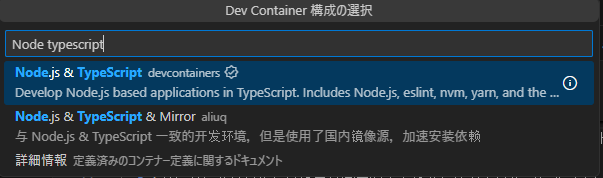

# 環境構築

- React学習環境の環境構築について記載したもの

## 目次

- [環境構築](#環境構築)
  - [目次](#目次)
  - [参考](#参考)
  - [開発環境](#開発環境)
    - [選定理由](#選定理由)
    - [手順](#手順)

## 参考

- 公式ドキュメント-インストール https://ja.react.dev/learn/installation

## 開発環境

- devcontainerとVSCodeを使用
- ReactとTypeScriptがインストールされたコンテナを使用する
- 必要に応じてコンテナ上にアプリをインストールする

### 選定理由

- dev containerのコンテナで開発環境を作成する
  - 選定理由
    - コンテナ内のlinux環境で開発を行える
    - 開発環境の共有がしやすい
    - 不具合が起きたときの再起動・環境の再構築が容易
    - Virtual Machine環境より軽量、立ち上げが容易
- また、Reactのロジックを学習するだけならブラウザ上のエディター等でも機能は十分
  - (参考)https://codesandbox.io/s/j67kkz?file=/src/App.js&utm_medium=sandpack

### 手順

- docker for Desktopをインストールしていない場合インストールを行う(再起動必要)
  - https://docs.docker.jp/docker-for-windows/install.html
- docker for Desktopを起動
- VSCodeの拡張機能`Dev Containers`をインストール
- 左下の`><`のマークから`新しい開発コンテナー`を選択
- 入力欄に`node typescript`と入力し、コンテナ名`Node.js & TypeScript`を選択

以上